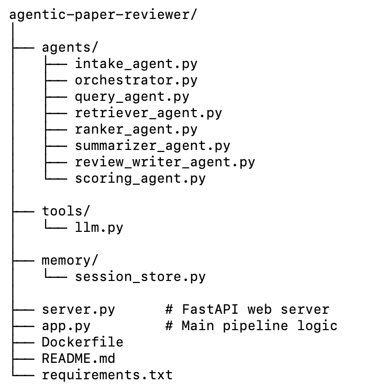

# 📄 Agentic Paper Reviewer  
### Enterprise AI Multi-Agent System for Automated Academic Paper Review  
**Built for Kaggle Google Agents Capstone — Enterprise Track**

---

## 🚀 Overview

Agentic Paper Reviewer is a **multi-agent system** designed to automatically read, analyze, contextualize, and review academic research papers.  
It simulates the workflow of a real peer reviewer by extracting content, searching related work, evaluating novelty, summarizing findings, and generating final review scores.

This project is built entirely with **Gemini-powered agents**, incorporates **parallel + sequential agents**, includes **session state**, **tooling**, **logging**, and is fully **deployable on Google Cloud Run**.

---

## 🧩 Key Features

### ✔️ Multi-Agent Architecture
- **Sequential agents** (Intake → Orchestrator → Query Builder → Retriever → Ranker → Reviewer → Scoring)
- **Parallel agents** (Concurrent summarization of related papers)
- **Loop agents** (Retry logic for Gemini quota and invalid key handling)

### ✔️ Tools
- Custom `gemini_text()` tool with:
  - Quota handling
  - Exponential backoff
  - Model switching via env vars
- PDF parsing tool  
- ArXiv retriever tool

### ✔️ Memory & Sessions
- Custom `SessionState` class  
- Stores extracted title, related papers, summaries, final review  
- Log history for observability

### ✔️ Observability
- Structured logging  
- Logs for each agent step  
- Execution time tracking  
- Error propagation for debugging

### ✔️ Deployment Ready
- Dockerfile included  
- Cloud Run deployment commands provided  
- Works via simple `POST /review` endpoint

---

## Architecture


## Folder Structure


## Setup

```bash
python3 -m venv venv
source venv/bin/activate   # Windows: venv\Scripts\activate
pip install -r requirements.txt
```

Set Gemini env vars:

```bash
export GEMINI_API_KEY="YOUR_KEY"
export GEMINI_MODEL="gemini-1.5-pro"
```

## Run (CLI)

```bash
python app.py path/to/paper.pdf
```

## Run (API)

```bash
uvicorn server:app --reload
```

Open:
`http://127.0.0.1:8000/docs`

## Deploy to Cloud Run (ADK)

```bash
adk deploy cloud_run \
  --project YOUR_GCP_PROJECT_ID \
  --region us-central1 \
  --service-name agentic-paper-reviewer \
  --set-env-vars GEMINI_API_KEY=$GEMINI_API_KEY,GEMINI_MODEL=$GEMINI_MODEL
```

## Notes
- Do not commit API keys.
- Prefer text-based PDFs (arXiv PDFs work well).
